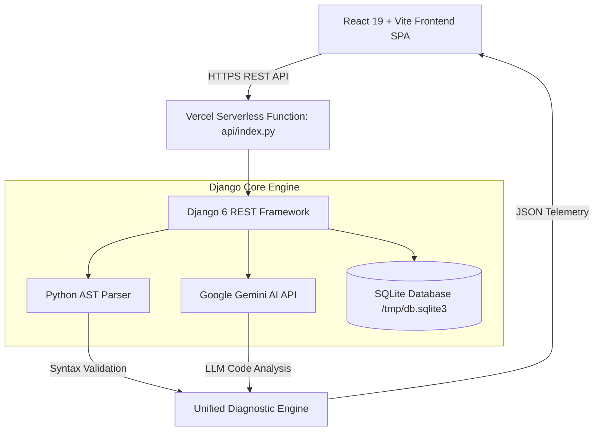

<div align="center">

# ⚡ CodePulse Studio

### *AI-Assisted Python Code Diagnostics & Interactive Error Telemetry*

[](https://code-pulse-eta.vercel.app/)
[](https://react.dev/)
[](https://www.djangoproject.com/)
[](https://vitejs.dev/)
[](https://ai.google.dev/)
[](LICENSE)

<br/>

> **CodePulse Studio** is a full-stack developer workspace for Python error diagnosis, interactive learning, and real-time code optimization. Powered by Python's native **Abstract Syntax Tree (AST)** parser combined with **Google Gemini AI**, CodePulse pinpoints exact syntax errors, style anomalies, and logical bugs—delivering **3-tier tailored explanations** for every developer level.

</div>

---

## 🌐 Live Demo & GitHub Repository

- 🚀 **Live Demo URL**: [https://code-pulse-eta.vercel.app/](https://code-pulse-eta.vercel.app/)
- 📦 **GitHub Repository**: [PativalaDhruvik/Code_Pulse](https://github.com/PativalaDhruvik/Code_Pulse.git)

---

## 🌟 Key Highlights & Features

| Feature | Description |
| :--- | :--- |
| ⚡ **Dual AST + AI Engine** | Combines deterministic Python AST compilation checks with Google Gemini LLM for deep semantic analysis. |
| 📍 **Precision Cursor Pinpointing** | Identifies exact line numbers, column offsets, and erroneous variable tokens in real time. |
| 🎓 **3-Tier Educational Views** | Switch seamlessly between **Newbie** (beginner-friendly), **Comfortable** (technical depth), and **Facts** (direct code fix). |
| 📚 **Interactive Error Library** | 15+ pre-seeded searchable Python syntax warnings, style guidelines, and logic bug definitions. |
| 🧩 **Practice Debugging Puzzles** | Hands-on coding exercises to test and improve error diagnostics skills. |
| 📊 **Telemetry Dashboard** | Interactive charts powered by Recharts monitoring error frequencies, cleanliness scores, and submission trends. |

---

## 🎓 3-Tier Educational Explanations

CodePulse turns complex compiler errors into intuitive learning moments:

```
                  ┌─────────────────────────────────────────┐
                  │          Code Pulse Diagnostic          │
                  └────────────────────┬────────────────────┘
                                       │
         ┌─────────────────────────────┼─────────────────────────────┐
         ▼                             ▼                             ▼
  🌱 Newbie Mode                💡 Comfortable Mode           🟢 Just the Facts
  Simple, jargon-free          Technical explanation of        Actionable solution &
  analogy for beginners        scope, memory, and AST rules    refactored code block
```

---

## 🏗️ System Architecture



---

## 🚀 Quick Deployment Guide on Vercel

CodePulse is fully configured for zero-config single-command deployment on **Vercel**:

### 1. Push to GitHub
```bash
git add .
git commit -m "Enhance CodePulse Vercel deployment"
git push origin main
```

### 2. Deploy on Vercel
1. Navigate to [Vercel Dashboard](https://vercel.com/new).
2. Select your repository: **`PativalaDhruvik/Code_Pulse`**.
3. Set Environment Variable *(optional)*:
   - `GEMINI_API_KEY`: *(Your Google Gemini API Key)*
4. Click **Deploy**!

---

## 💻 Local Development Setup

### Prerequisites
- **Node.js**: v18.0+
- **Python**: v3.10+

### Step-by-Step Setup

```bash
# 1. Clone the repository
git clone https://github.com/PativalaDhruvik/Code_Pulse.git
cd Code_Pulse

# 2. Install Node dependencies
npm install

# 3. Setup Python Backend Virtual Environment
cd backend
python -m venv .venv

# On Windows:
.venv\Scripts\activate
# On macOS/Linux:
source .venv/bin/activate

pip install -r requirements.txt
cd ..

# 4. Launch Development Servers (Frontend + Backend concurrently)
npm run dev
```

- **Frontend Application**: `http://localhost:5173`
- **Backend REST API**: `http://localhost:8000/api`

---

<div align="center">

Made with ❤️ by [Pativala Dhruvik](https://github.com/PativalaDhruvik) • Distributed under the **MIT License**

</div>
